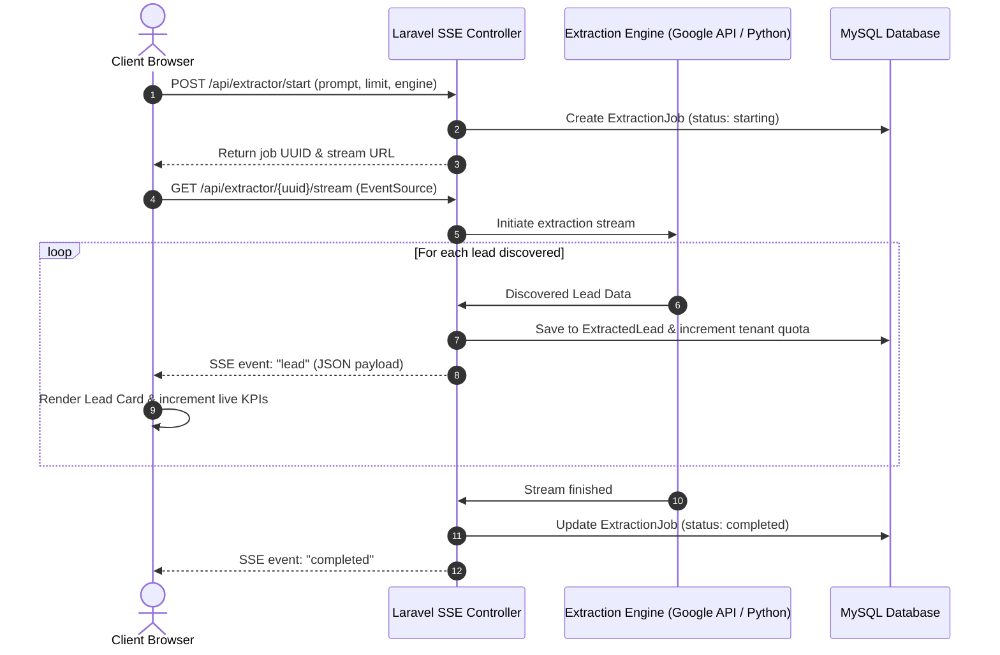

# Leads Engine — Architecture & System Design

**Leads Engine** is a high-performance, multi-tenant SaaS lead generation and enrichment platform built with **Laravel 12**, **Google Places Platform API**, and an optional **Python FastAPI / Playwright Chromium service**.

---

## 1. High-Level Architecture

Leads Engine uses a **Dual Extraction Engine** architecture:

```text
┌────────────────────────────────────────────────────────────────────────────────────────┐
│                                   Browser Client (UI)                                  │
│                 Vuexy / POS Glass Surface System & Server-Sent Events (SSE)            │
└───────────────────────────────────────────┬────────────────────────────────────────────┘
                                            │
                                            ▼
┌────────────────────────────────────────────────────────────────────────────────────────┐
│                                  Laravel 12 Core App                                   │
│  • Multi-Tenancy & Scoping (Tenant ID)     • Role Authorization (Super Admin / Admin) │
│  • Lead Database & History Audit           • Real-time SSE Stream Controller          │
│  • Contact Enrichment (Regex Web Scraping) • Excel (.xlsx) & CSV Exporter             │
└─────────────────────┬───────────────────────────────────────────┬──────────────────────┘
                      │                                           │
         [Mode A: Google Places API]                 [Mode B: Local/VPS Browser]
                      │                                           │
                      ▼                                           ▼
┌───────────────────────────────────────────┐ ┌───────────────────────────────────────────┐
│     Google Places Platform API (HTTPS)    │ │       Python FastAPI Service (:8001)      │
│  • Direct API querying via Guzzle/Http    │ │  • Playwright Chromium browser crawler   │
│  • Instant search across worldwide Maps   │ │  • Human-verification pause/resume       │
│  • No Python runtime or VPS required      │ │  • DOM parsing & background enrichment   │
└───────────────────────────────────────────┘ └───────────────────────────────────────────┘
```

---

## 2. Dual Extraction Engines Explained

### Engine A: Google Places Platform API (Default & Production)
- **Technology**: Native PHP (`Illuminate\Support\Facades\Http`).
- **Runtime**: Runs 100% inside Laravel on standard shared hosting (e.g. Hostinger) or VPS.
- **Workflow**:
  1. Client initiates a search query (e.g. `Dentists in Miami FL` or `Plumbers with Zip Code 90210`).
  2. Laravel connects to `https://places.googleapis.com/v1/places:searchText`.
  3. Retrieves validated business name, phone number, complete street address, website URL, rating, reviews count, and photo metadata.
  4. Discovered websites are inspected in the background for public contact emails (`/`, `/contact`, `/about`).
  5. Leads are saved to MySQL and streamed live via Server-Sent Events (SSE).

### Engine B: Browser Extractor (Chromium / Playwright)
- **Technology**: Python 3.12+ / FastAPI / Playwright / Uvicorn.
- **Runtime**: Local development or dedicated VPS.
- **Workflow**:
  1. Spawns an automated Chromium browser session.
  2. Directly scrolls Google Maps web interface, parsing DOM elements.
  3. Emits live SSE events to Laravel.
  4. If a CAPTCHA occurs, pauses in `WAITING_FOR_HUMAN_VERIFICATION`, allowing manual completion before resuming.

---

## 3. Multi-Tenant Database Architecture

All extraction jobs and extracted leads are strictly isolated by `tenant_id`:

```text
┌─────────────────┐       ┌─────────────────┐       ┌─────────────────┐
│     Tenants     │◀──────│      Users      │◀──────│ ExtractionJobs  │
├─────────────────┤1    * ├─────────────────┤1    * ├─────────────────┤
│ id              │       │ id              │       │ id              │
│ name            │       │ tenant_id (FK)  │       │ tenant_id (FK)  │
│ slug            │       │ role            │       │ user_id (FK)    │
│ plan            │       │ name            │       │ uuid            │
│ lead_quota      │       │ email           │       │ prompt          │
│ leads_extracted │       │ password        │       │ mode (api/live) │
│ google_maps_key │       │ is_active       │       │ status          │
└─────────────────┘       └─────────────────┘       └────────┬────────┘
                                                             │1
                                                             │
                                                             │*
                                                    ┌────────▼────────┐
                                                    │  ExtractedLeads │
                                                    ├─────────────────┤
                                                    │ id              │
                                                    │ tenant_id (FK)  │
                                                    │ job_id (FK)     │
                                                    │ name            │
                                                    │ phone           │
                                                    │ email           │
                                                    │ website         │
                                                    │ rating          │
                                                    │ address         │
                                                    └─────────────────┘
```

---

## 4. Real-Time Streaming Lifecycle (SSE)

Leads are never polled in batch. Instead, they stream instantly using Server-Sent Events:


