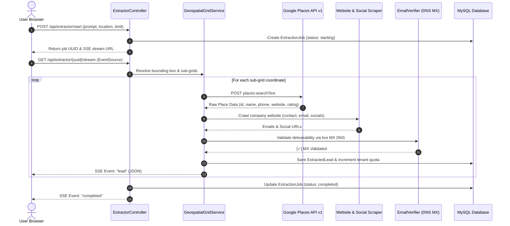

# Leads Engine — Complete Architecture & System Design

**Leads Engine** (branded as **VektorLeads**) is an enterprise-grade, multi-tenant B2B lead generation, intelligence enrichment, and autonomous outreach platform. Built on **Laravel 12**, **PHP 8.3**, and **MySQL 8.0+**, it combines direct API geospatial discovery with browser crawling, AI-powered sales asset generation, and integrated email messaging.

---

## 1. High-Level 4-Layer System Architecture

```text
┌────────────────────────────────────────────────────────────────────────────────────────┐
│                               1. PRESENTATION LAYER                                    │
│  • Blade Components + Modern Vuexy / POS Glass Surface System (Dark / Light / System)  │
│  • Real-Time Server-Sent Events (SSE) Live Feed with Dynamic Counters                 │
│  • SweetAlert2 Interactive Modals, Rich Text Outreach Editor, Responsive Data Tables   │
└───────────────────────────────────────────┬────────────────────────────────────────────┘
                                            │
                                            ▼
┌────────────────────────────────────────────────────────────────────────────────────────┐
│                           2. APPLICATION & SAAS CORE LAYER                             │
│  • Multi-Tenancy Scoping (Strict isolation by tenant_id across all Eloquent queries)  │
│  • Role-Based Access Control (Super Admin, Tenant Admin, Team Member)                  │
│  • Impersonation Engine (Super Admin -> Tenant Admin, Tenant Admin -> Staff)           │
│  • User Invitations Pipeline (Cryptographic token verification & expiration)           │
│  • Quota Monitoring & Rate Limiting (Monthly lead caps, seat caps, plan enforcement)  │
│  • Memory-Safe OpenSpout Streaming Exporter (.xlsx, .csv, .json)                      │
└─────────────────────┬───────────────────────────────────────────┬──────────────────────┘
                      │                                           │
                      ▼                                           ▼
┌───────────────────────────────────────────┐ ┌───────────────────────────────────────────┐
│       3. DISCOVERY & INTELLIGENCE LAYER   │ │       4. CONVERSION & MESSAGING LAYER     │
│  • Google Places Platform API (New v1)    │ │  • Gemini 2.5 Flash AI Landing Page Engine│
│  • Geospatial Subgrid Coordinate Matrix   │ │  • Spec Website Public Preview Route      │
│  • Python Chromium Crawler (Playwright)   │ │  • Dynamic Email Template Tag Engine      │
│  • Deep Website Scraper (SSRF-Safe Guzzle)│ │  • Direct Multi-Account SMTP Dispatcher   │
│  • Social Media Footprint Extractor       │ │  • Unified Inbox Hub (Gmail API & IMAP)   │
│  • 3-Tier Email Verifier (RFC + Temp + MX)│ │  • Thread Detection & Reply System        │
└───────────────────────────────────────────┘ └───────────────────────────────────────────┘
```

---

## 2. Extraction Pipeline & Data Flow

### Mode A: Google Places Platform API (Production Default)
- **Zero Python or VPS dependencies**; runs entirely inside Laravel.
- **Workflow**:
  1. **Geocoding & Grid Splitting**: Resolves target location (e.g. `Austin, TX`) to latitude/longitude bounding boxes. If limit > 60, divides the metro area into high-resolution radial micro-grids using `GeospatialGridService`.
  2. **Places Text Search (New v1)**: Issues parallel HTTPS requests using Guzzle/Http with optimized field masks (`places.id`, `places.displayName`, `places.formattedAddress`, `places.nationalPhoneNumber`, `places.websiteUri`, `places.rating`, `places.userRatingCount`, `places.photos`).
  3. **Contact & Social Scraping**: For discovered websites, Laravel executes an asynchronous SSRF-safe HTTP request with a 2.5s timeout, parsing homepage and `/contact` HTML:
     - Regex email discovery (`[a-zA-Z0-9._%+-]+@[a-zA-Z0-9.-]+\.[a-zA-Z]{2,}`).
     - Social media profiles (LinkedIn, Facebook, Instagram, Twitter/X, YouTube).
  4. **3-Tier Email Verification**: Discovered emails are checked for syntax, temporary domains, and live DNS MX records (cached for 24h).
  5. **Persistence & SSE Streaming**: Leads are persisted into `extracted_leads` under the active `tenant_id` and pushed to the client via Server-Sent Events.



### Mode B: Browser Extractor (Chromium / Playwright)
- Microservice written in Python 3.12+ (FastAPI + Playwright) running on `http://127.0.0.1:8001` or a dedicated VPS.
- Navigates Google Maps directly in headless or headful mode.
- Non-invasive CAPTCHA handling: Pauses in `waiting_for_human_verification` and notifies Laravel. Once completed by a human, extraction resumes seamlessly.

---

## 3. Conversion Layer: AI Spec Website Generator & Preview

To turn cold outreach into closed deals, Leads Engine includes an AI Spec Website Generator powered by Google Gemini (`gemini-2.5-flash`):

1. **Generation Trigger**: A user clicks "Generate Spec Website" for a lead, or it is triggered during automated campaign dispatch.
2. **AI Prompting**: `GeminiWebsiteService` compiles the lead's business name, category, city, rating, and phone, passing them to Gemini with a strict schema requirement.
3. **Structured Design Tokens & Copy**: Gemini returns tailored Tailwind color tokens, niche font family, hero layout (`split-with-form`, `gallery-grid`, `centered-bold`), industry value props, service catalog, testimonials, and trust badges.
4. **Public Preview Route (`/preview/{uuid}`)**: Serves a public, standalone landing page featuring the generated website, complete with interactive forms, simulated booking, and a prominent sticky banner: **"Are you the owner of {Business Name}? Claim this website"**.
5. **Dynamic Cold Pitching**: Outreach emails dynamically inject `{{demo_website_url}}`, giving prospects an immediate reason to respond.

---

## 4. Unified Email Inbox Hub Architecture

Leads Engine includes a multi-account email synchronization and messaging center (`/gmail`):

```text
┌────────────────────────────────────────────────────────────────────────────────────────┐
│                                Unified Email Hub                                       │
├───────────────────────────────────────────┬────────────────────────────────────────────┤
│           Google Gmail (OAuth 2.0)        │          Hostinger / Custom IMAP & SMTP    │
├───────────────────────────────────────────┼────────────────────────────────────────────┤
│ • OAuth 2.0 Web Flow with Refresh Token   │ • Direct SSL/TLS IMAP sync on port 993     │
│ • Incremental Gmail API messages sync     │ • Native RFC 822 MIME parsing (PECL / PHP) │
│ • Webhook-ready sync trigger              │ • SMTP reply dispatch on port 465 / 587    │
└───────────────────────────────────────────┴────────────────────────────────────────────┘
                                            │
                                            ▼
┌────────────────────────────────────────────────────────────────────────────────────────┐
│                                 Message Center                                         │
│  • Thread Grouping & Lead Association (Matches sender email to ExtractedLead record)   │
│  • Star, Mark Read/Unread, Search, and Full HTML Thread Viewer                         │
│  • Direct Reply with In-Reply-To and References header tracking                        │
└────────────────────────────────────────────────────────────────────────────────────────┘
```

---

## 5. Multi-Tenant Database Schema

The database design ensures absolute tenant isolation and relational integrity:

```text
┌─────────────────────────┐
│         Tenants         │
├─────────────────────────┤
│ id (PK)                 │
│ name                    │
│ slug                    │
│ plan                    │
│ lead_quota              │
│ leads_extracted_count   │
│ google_maps_api_key     │
│ is_active               │
└────────────┬────────────┘
             │1
             │
             ├──────────────────────────┬──────────────────────────┐
             │*                         │*                         │*
┌────────────▼────────────┐ ┌───────────▼────────────┐ ┌───────────▼────────────┐
│          Users          │ │     ExtractionJobs     │ │     GmailAccounts      │
├─────────────────────────┤ ├────────────────────────┤ ├────────────────────────┤
│ id (PK)                 │ │ id (PK)                │ │ id (PK)                │
│ tenant_id (FK)          │ │ tenant_id (FK)         │ │ tenant_id (FK)         │
│ role (admin/member)     │ │ user_id (FK)           │ │ provider (google/host) │
│ name                    │ │ uuid                   │ │ email                  │
│ email                   │ │ prompt                 │ │ access_token           │
│ password                │ │ location               │ │ refresh_token          │
│ is_active               │ │ mode (google_api/live) │ │ imap_host / smtp_host  │
└────────────┬────────────┘ │ status                 │ └───────────┬────────────┘
             │1             │ leads_extracted        │             │1
             │              └───────────┬────────────┘             │
             │*                         │1                         │*
┌────────────▼────────────┐             │              ┌───────────▼────────────┐
│     UserInvitations     │             │*             │     GmailMessages      │
├─────────────────────────┤    ┌────────▼────────────┐ ├────────────────────────┤
│ id (PK)                 │    │    ExtractedLeads   │ │ id (PK)                │
│ tenant_id (FK)          │    ├─────────────────────┤ │ account_id (FK)        │
│ email                   │    │ id (PK)             │ │ lead_id (FK, nullable) │
│ role                    │    │ tenant_id (FK)      │ │ message_id             │
│ token                   │    │ job_id (FK)         │ │ thread_id              │
│ expires_at              │    │ uuid                │ │ sender_email           │
└─────────────────────────┘    │ business_name       │ │ subject                │
                               │ category            │ │ body_html              │
                               │ phone               │ │ is_read / is_starred   │
                               │ emails (JSON array) │ └────────────────────────┘
                               │ website             │
                               │ rating / reviews    │
                               │ address / coords    │
                               │ social_links (JSON) │
                               │ email_deliverable   │
                               │ generated_website_* │
                               │ status / is_saved   │
                               └─────────────────────┘
```

---

## 6. Security, Isolation & Performance Protections

1. **Database-Level Multi-Tenant Scoping**:
   All tenant records are filtered using explicit `tenant_id` scopes. Super Admins possess explicit bypass overrides for support and tenancy provisioning.
2. **SSRF Protection**:
   When crawling company websites for emails and social handles, IP resolution is checked to reject private and loopback networks (`127.0.0.1`, `10.0.0.0/8`, `192.168.0.0/16`, AWS metadata `169.254.169.254`).
3. **Session Lock Avoidance**:
   Long-running SSE streams call `session_write_close()` before entering streaming loops to prevent blocking concurrent HTTP requests from the same user session.
4. **Memory-Safe OpenSpout Streaming**:
   Excel exports stream rows sequentially from cursor queries, avoiding `OutOfMemoryError` even on multi-thousand row spreadsheets.
