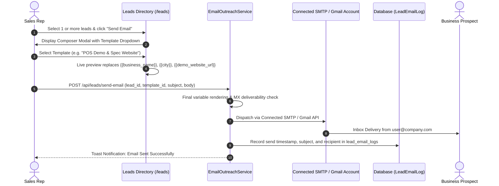

# Leads Engine — Email Outreach & Templates System

This guide covers the template manager, dynamic tag engine, direct cold outreach dispatcher, POS UI branding, and delivery audit logging in **Leads Engine** (VektorLeads).

---

## 1. Overview & Outreach Workflow

The direct email outreach suite allows sales teams and agencies to launch targeted cold outreach directly from within Leads Engine using connected SMTP mailboxes or Gmail accounts.

---

## 2. Dynamic Variable Engine

Templates support automatic variable interpolation. When composing or previewing emails, the `EmailOutreachService` replaces dynamic tags with prospect-specific values:

| Dynamic Tag | Source Column | Sample Rendered Output |
| :--- | :--- | :--- |
| `{{business_name}}` | `extracted_leads.business_name` | Austin Premier Roofing |
| `{{email}}` | Discovered primary email | contact@austinpremierroofing.com |
| `{{phone}}` | `extracted_leads.phone` | +1 (512) 555-0199 |
| `{{city}}` | `extracted_leads.city` | Austin |
| `{{category}}` | `extracted_leads.category` | Roofing Contractor |
| `{{website}}` | `extracted_leads.website` | https://austinpremierroofing.com |
| `{{rating}}` | `extracted_leads.rating` | 4.9 |
| `{{reviews_count}}` | `extracted_leads.review_count` | 88 |
| `{{demo_website_url}}`| Generated Preview Route | `https://leads.obtainsolutions.com/preview/8b9e...` |
| `{{pos_url}}` | Configured POS Demo URL | `https://pos.obtainsolutions.com/` |
| `{{app_url}}` | System Application URL | `https://leads.obtainsolutions.com` |
| `{{sender_name}}` | Authenticated user name | Alex Turner |

---

## 3. Pre-Configured Modern POS Email Templates

Every workspace includes high-converting pre-configured email templates aligned with modern POS and web development agency sales pitches:

1. **POS Demo & Operations Pitch**:
   - Pitches inventory management, real-time sales reporting, and mobile POS checkout tailored to retail, salons, and restaurants.
   - Includes live clickable link: `{{pos_url}}`.
2. **AI Spec Website & Redesign Pitch**:
   - Pitches businesses with missing or outdated websites.
   - Automatically embeds the live interactive landing page generated by Gemini AI: `{{demo_website_url}}`.
3. **Local SEO & Reputation Audit**:
   - References the business's current Google Maps star rating and review count, offering Google Business Profile optimization.
4. **General B2B Partnership**:
   - Clean, professional introduction for agency and enterprise outreach.

### Restoring Default Templates:
If an admin edits or deletes system templates and wants to restore the original library:
- Click **"Restore Default Templates"** at `/email-templates`.
- Endpoint: `POST /email-templates/restore-defaults`.
- Safely updates existing system templates without modifying custom user-created templates.

---

## 4. Single-Lead vs. Bulk Outreach Dispatch

### Single Lead Send:
- Click the **"Send Email"** pill button on any lead card or table row.
- Opens the rich-text modal composer pre-loaded with the workspace's default template.
- Review and tweak copy before clicking **"Send Now"**.

### Bulk Campaign Dispatch:
- Select checkboxes next to target leads (or click "Select All on Page").
- Click **"Bulk Email Campaign"** in the floating action bar.
- The system queues and dispatches personalized emails sequentially, ensuring rate limits and provider SMTP quotas are respected.

---

## 5. Deliverability Logging & Lead State Transitions

- Every dispatched email creates a record in `lead_email_logs` (`tenant_id`, `lead_id`, `user_id`, `recipient_email`, `subject`, `status`, `sent_at`).
- Dispatched leads automatically transition their CRM status from `lead` to `contacted`.
- When a prospect replies, the incoming message is matched by email address and updates the lead status to `replied`.
