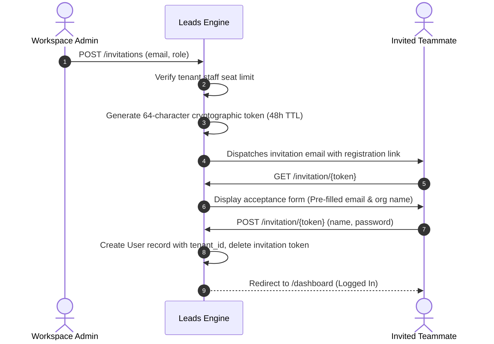

# Leads Engine — SaaS Multi-Tenancy, Roles & Access Control

This document details the multi-tenant architecture, user roles, permission boundaries, user invitations, impersonation mechanics, and subscription quota enforcement in **Leads Engine** (VektorLeads).

---

## 1. User Roles & Capabilities Matrix

The platform implements a strict 3-tier Role-Based Access Control (RBAC) hierarchy:

| Feature / Module | 👑 Super Admin | 🏢 Workspace Admin (`admin`) | 👤 Team Member (`member`) |
| :--- | :---: | :---: | :---: |
| **Extraction Dashboard (`/dashboard`, `/extractor`)** | ✅ | ✅ | ✅ |
| **Lead Search & Filtering (`/leads`)** | ✅ All Tenants | ✅ All Org Leads | ✅ Assigned / Own Leads |
| **Bulk Lead Actions (Save, Discard, Delete)** | ✅ | ✅ | ✅ (Own Leads) |
| **Data Export (`.xlsx`, `.csv`, `.json`)** | ✅ | ✅ | ✅ |
| **Spec Website Generator (`/api/leads/{id}/generate-demo`)** | ✅ | ✅ | ✅ |
| **Email Templates (View & Use in Outreach)** | ✅ | ✅ | ✅ |
| **Email Templates (Create, Edit, Delete, Restore)** | ✅ | ✅ | ❌ |
| **Unified Email Inbox Hub (`/gmail`)** | ✅ | ✅ | ✅ |
| **Connect / Disconnect Email Accounts** | ✅ | ✅ | ❌ |
| **Workspace Settings & Custom API Keys (`/settings`)** | ✅ | ✅ | ❌ |
| **Team Management & User Invitations (`/settings#team`)** | ✅ | ✅ | ❌ |
| **Impersonate Team Member** | ✅ | ✅ | ❌ |
| **Tenant Workspaces Administration (`/tenants`)** | ✅ | ❌ | ❌ |
| **Impersonate Tenant Workspace** | ✅ | ❌ | ❌ |
| **SaaS Subscription Plans CRUD (`/plans`)** | ✅ | ❌ | ❌ |

---

## 2. Multi-Tenant Data Isolation

### Scoping Enforcement
1. **Tenant Identification**: Every authenticated user belongs to a `Tenant` model via `tenant_id`.
2. **Automatic Eloquent Scoping**:
   - `ExtractionJob`, `ExtractedLead`, `EmailTemplate`, `GmailAccount`, and `UserInvitation` records are scoped by `tenant_id`.
   - Workspace Admins and Team Members cannot read, edit, or delete records belonging to another tenant under any circumstance.
   - Any attempt to manipulate foreign resource IDs returns a `403 Forbidden` or `404 Not Found`.

### Team Member Isolation
Within an organization:
- **Workspace Admin**: Can view and manage all leads extracted across all team members in the tenant.
- **Team Member**: By default, views and performs bulk operations on leads created by their own user account, keeping lead pipelines clean and uncluttered.

---

## 3. Team Member Invitations Workflow

Workspace Admins can invite additional team members while adhering to the workspace's seat limit:

### Safety Rules:
- Invitations cannot be issued to an email address already registered on the platform.
- Duplicate pending invitations to the same email address are blocked.
- Admins can revoke a pending invitation anytime to immediately reclaim the seat slot.

---

## 4. Impersonation Framework

Leads Engine includes an impersonation engine for troubleshooting, customer support, and administrative management:

1. **Super Admin -> Tenant Admin**:
   - Super Admins can click "Impersonate" next to any tenant on `/tenants`.
   - The session switches to the tenant's primary admin account, allowing the Super Admin to see the exact UI, quotas, and leads seen by the customer.
2. **Workspace Admin -> Team Member**:
   - Workspace Admins can impersonate their team members via `/settings#team` to inspect individual pipelines or assist with search queries.
   - Admins cannot impersonate other admins or staff belonging to another tenant.
3. **Impersonation Banner & Stop Session**:
   - A sticky header banner alerts the user: *"You are currently impersonating {Name} ({Role}) — [Exit Impersonation]"*.
   - Clicking `GET /impersonate/stop` immediately restores the original user's authenticated session.

---

## 5. Subscription Plans & Quotas

Tenants are provisioned with configurable subscription tiers:

| Plan Level | Monthly Lead Quota | Max Staff Seats | Engine Access | Email Accounts |
| :--- | :---: | :---: | :---: | :---: |
| **Starter** | 1,000 leads | 2 seats | Google Places API | 1 Account |
| **Growth** | 10,000 leads | 5 seats | Google Places API + Browser | 3 Accounts |
| **Agency / Pro** | 25,000 leads | 10 seats | Google Places API + Browser | 10 Accounts |
| **Enterprise** | Unlimited / Custom | Unlimited | Priority API + Custom Quota | Unlimited |

### Quota Enforcement:
- When an extraction job runs, each saved lead increments `tenants.leads_extracted_count`.
- If a tenant reaches their monthly limit, extraction jobs are blocked with a clear upgrade prompt.
- Super Admins can adjust quotas or reset usage counters at any time via the `/tenants` admin panel.
