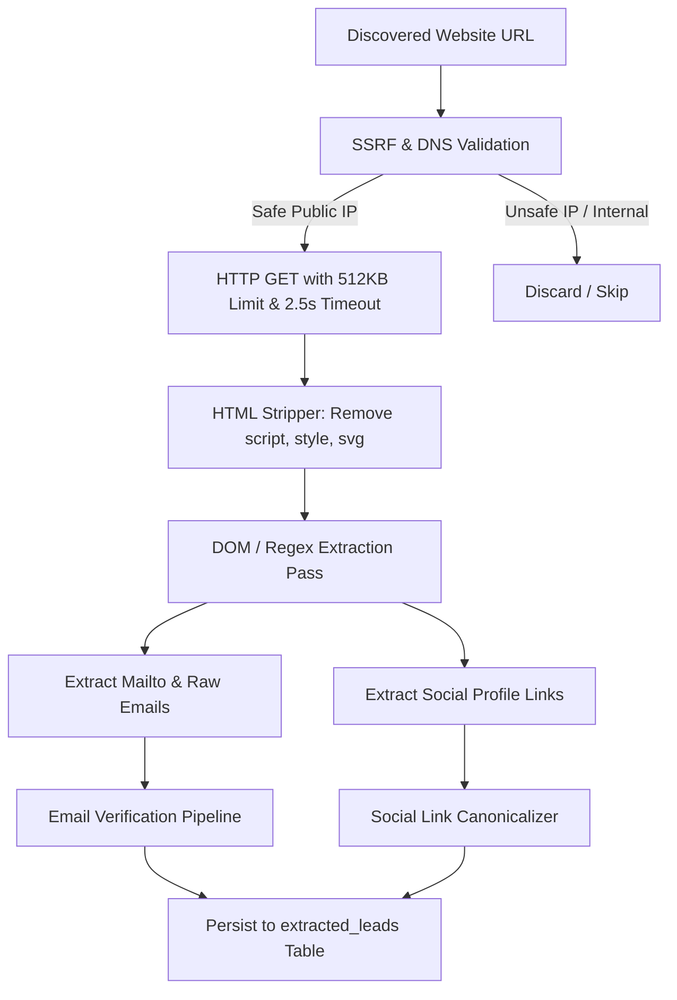
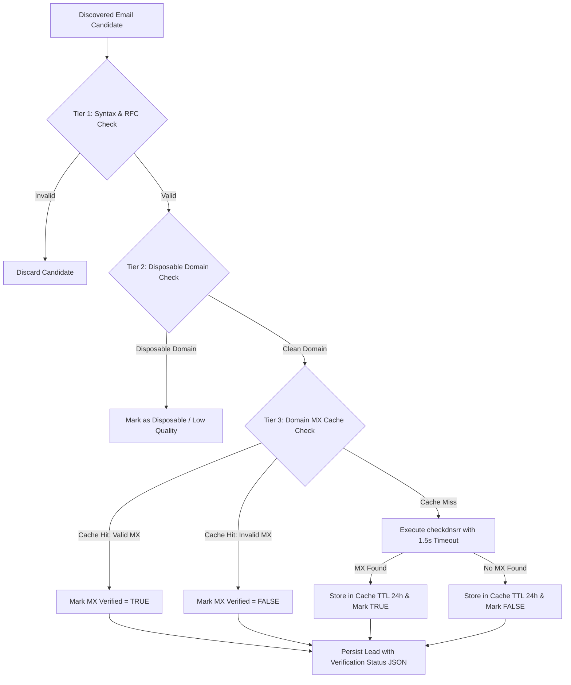

# Leads Engine — Architectural Audit, Hostinger Optimization & Feature Expansion Roadmap

**Author:** Senior Principal Web Architect  
**Target Platform:** Laravel 12 (PHP 8.2 / 8.3), MySQL 8.0+, Vuexy UI (Bootstrap 5), Hostinger Shared Hosting, Python 3.12 FastAPI VPS  
**Last Updated:** August 2026  

---

## Table of Contents

1. [Executive Overview](#1-executive-overview)
2. [Task 1: Codebase & Architecture Audit](#2-task-1-codebase--architecture-audit)
   - [2.1 Hostinger Constraints & Persistent Server-Sent Events (SSE)](#21-hostinger-constraints--persistent-server-sent-events-sse)
   - [2.2 Native Regex Web Scraping & Memory/Security Analysis](#22-native-regex-web-scraping--memorysecurity-analysis)
   - [2.3 Multi-Tenant Isolation, Scoping & Authorization Vulnerabilities](#23-multi-tenant-isolation-scoping--authorization-vulnerabilities)
3. [Task 2: Feature Expansion Architecture & Technical Blueprint](#3-task-2-feature-expansion-architecture--technical-blueprint)
   - [3.1 Social Media Link Extraction Engine](#31-social-media-link-extraction-engine)
   - [3.2 Memory-Safe Massive Export Engine (.xlsx & .csv)](#32-memory-safe-massive-export-engine-xlsx--csv)
   - [3.3 Automated Email Verification Pipeline (RFC + Disposable + MX Lookup)](#33-automated-email-verification-pipeline-rfc--disposable--mx-lookup)
4. [Phased Implementation Roadmap](#4-phased-implementation-roadmap)
   - [Phase 1: Security Hardening & Tenant Isolation](#phase-1-security-hardening--tenant-isolation)
   - [Phase 2: Data Enrichment Pipeline (Socials + MX Validation)](#phase-2-data-enrichment-pipeline-socials--mx-validation)
   - [Phase 3: High-Capacity Streaming Export Engine](#phase-3-high-capacity-streaming-export-engine)
   - [Phase 4: Shared-Hosting Cron & Queue Worker Orchestration](#phase-4-shared-hosting-cron--queue-worker-orchestration)

---

## 1. Executive Overview

Leads Engine is designed with a **Dual Extraction Engine**:
- **Engine A (Native Laravel):** Leverages the Google Places Platform API (Text Search) via Laravel's HTTP client (`GooglePlacesService`), followed by inline regex HTML inspection for contact emails.
- **Engine B (Python FastAPI / Playwright):** A microservice executing headless Chromium browser crawling for manual Google Maps scraping with interactive human-verification checkpoints.

While the dual-engine concept is solid, deploying real-time streaming (SSE), synchronous regex web scraping, and multi-tenant SaaS operations on **Hostinger Shared Hosting** (under cPanel/hPanel, LiteSpeed/Apache, and CloudLinux LVE limits) requires strict operational boundaries to avoid **PHP worker exhaustion**, **session locking deadlocks**, **cross-tenant data exposure**, and **out-of-memory errors**.

```text
                                    ┌────────────────────────────────────────────────────────┐
                                    │               Hostinger Shared Hosting                 │
                                    │                                                        │
┌─────────────────────────┐         │  ┌──────────────────────┐    ┌──────────────────────┐  │
│  Client (Vuexy UI)      │  HTTP   │  │  LiteSpeed / Apache  │    │      MySQL 8.0+      │  │
│  - SSE EventSource      │─────────┼─▶│  (Entry Process LVE) │───▶│  - Tenants / Users   │  │
│  - Chunked Fallback     │◀────────┼──│  (LSAPI / PHP-FPM)   │    │  - Extracted Leads   │  │
│  - XLSX Export Request  │         │  └──────────┬───────────┘    │  - Extraction Jobs   │  │
└─────────────────────────┘         │             │                └──────────────────────┘  │
                                    │             ▼                                          │
                                    │  ┌──────────────────────────────────────────────────┐  │
                                    │  │ Engine A: Laravel 12 Native Runner               │  │
                                    │  │  - Places API (Text Search)                      │  │
                                    │  │  - SSRF-Safe HTTP Client (Timeout: 2.5s)        │  │
                                    │  │  - DOM/Regex Parser (Email + Socials)            │  │
                                    │  │  - MX DNS Domain Cache (24h TTL)                 │  │
                                    │  │  - OpenSpout Streaming XLSX Exporter             │  │
                                    │  └──────────────────────────────────────────────────┘  │
                                    └────────────────────────────────────────────────────────┘
                                                                  │
                                                Internal Token /  │ (Engine B Proxy)
                                                JSON Stream       ▼
                                    ┌────────────────────────────────────────────────────────┐
                                    │                   External Free VPS                    │
                                    │  ┌──────────────────────────────────────────────────┐  │
                                    │  │ Engine B: FastAPI + Playwright Chromium          │  │
                                    │  │  - Headless/Headful Browser Automation           │  │
                                    │  │  - Cloudflare / CAPTCHA Human Verification Flow  │  │
                                    │  │  - Native SSE Broadcaster (:8001)                │  │
                                    │  └──────────────────────────────────────────────────┘  │
                                    └────────────────────────────────────────────────────────┘
```

---

## 2. Task 1: Codebase & Architecture Audit

### 2.1 Hostinger Constraints & Persistent Server-Sent Events (SSE)

#### The Critical Risks on Shared Hosting
1. **Entry Process (EP / NPROC) Pool Exhaustion:**
   - Hostinger Shared Hosting enforces CloudLinux LVE limits, capping concurrent Entry Processes at **20–30 EP**.
   - In `ExtractorController::stream` and `GooglePlacesService::stream`, a single continuous PHP loop (`while (!feof($handle))` or `do { ... usleep(...) } while(...)`) locks up **1 dedicated PHP-FPM / LSAPI worker**.
   - **Failure Mode:** If 15–20 concurrent users initiate extractions or leave open browser tabs, all available PHP workers are locked. Any other visitor or API request to the website receives an immediate **HTTP 503 "Service Unavailable / Resource Limit Reached"**.

2. **PHP Session File Locking Deadlock:**
   - Standard Laravel requests initialize session handlers with an exclusive file lock.
   - If an SSE controller initiates streaming without closing the session, the session file remains locked for the entire 30–120s stream duration.
   - **Failure Mode:** The user cannot click "Stop Extraction", open other tabs, view leads, or navigate the dashboard; all concurrent requests from the same session hang until the SSE stream terminates.

3. **Web Server Timeouts & Proxy Buffering:**
   - LiteSpeed and Apache `mod_reqtimeout` / `mod_proxy_fcgi` forcibly kill idle or long-running HTTP connections exceeding 30s–60s (`max_execution_time`).
   - Although `X-Accel-Buffering: no` is passed, LiteSpeed's `gzip`/`brotli` output compression filter can still buffer chunks unless explicitly turned off via `zlib.output_compression = Off`.

4. **Database Connection Pool Saturation:**
   - Holding an SSE process open for minutes keeps a MySQL connection reserved, quickly hitting the shared host's `max_user_connections` limit (usually 30–50).

#### Architectural Optimization for Shared Hosting SSE
1. **Explicit Session Release:** Call `session_write_close()` before entering any streaming loop.
2. **Time-Sliced Bounded Streams (25-Second Chunks):** Limit each SSE connection to a maximum of 25 seconds. If the job is still running, send a graceful reconnect event `{"type": "reconnect", "cursor": 123}` and terminate the PHP process. The browser's native `EventSource` reconnects in 1 second, recycling the PHP worker.
3. **Heartbeat Keep-Alives:** Emit an SSE comment (`: ping\n\n`) every 10 seconds during external API waits to keep proxy sockets alive.
4. **Lightweight Polling Fallback:** Provide a short-polling fallback (`GET /api/extractor/{job}/status` + incremental leads hydration) if LiteSpeed forcibly closes SSE sockets.

---

### 2.2 Native Regex Web Scraping & Memory/Security Analysis

#### 1. Memory Accumulation in 50+ Site Loops
In `GooglePlacesService::quickEnrichWebsiteEmails()`:
- `Http::timeout(2.5)->get($websiteUrl)` loads full HTML bodies into memory.
- Modern enterprise websites frequently exceed 2MB–8MB with inlined SVGs, base64 images, and JavaScript bundles.
- Iterating over 50–100 websites in a single PHP execution context causes PHP’s Zend memory allocator to accumulate strings and Guzzle transfer buffers.
- **Remediation:**
  1. Truncate response bodies at download time (e.g., `Http::withOptions(['max_body_size' => 512 * 1024])` to read only the first 512KB).
  2. Explicitly `unset($html, $resp)` within the loop.
  3. Invoke `gc_collect_cycles()` periodically.

#### 2. Catastrophic Backtracking (ReDoS) & PCRE Limit Exhaustion
The regex pattern `/[a-zA-Z0-9._%+-]+@[a-zA-Z0-9.-]+\.[a-zA-Z]{2,}/i`:
- When executed over minified, single-line 5MB JS bundles, it triggers severe recursive backtracking in PCRE (`pcre.backtrack_limit`).
- On shared hosting with restricted memory and CPU thresholds, this spikes CPU usage to 100% and can result in silent process termination (`exit code 139`).
- **Remediation:**
  1. Strip `<script>`, `<style>`, `<svg>`, `<canvas>`, and `<noscript>` blocks before executing regex.
  2. Restrict regex scanning to text nodes and `mailto:` links.

#### 3. False Positives & Noise Filtering
The current filter checks for `.png`, `.jpg`, `.svg`, and `.webp` but fails on:
- Query-string assets (`logo@2x.png?v=3.2`).
- Webpack modules (`vendor@3.1.2.min.js`).
- Font MIME descriptors and CSS `@import` rules.
- **Remediation:** Pass matched candidates through `filter_var($email, FILTER_VALIDATE_EMAIL)` and validate domain syntax.

#### 4. Critical Security Risk: Server-Side Request Forgery (SSRF)
In `GooglePlacesService.php`, the safety check only verifies:
```php
$host = parse_url($websiteUrl, PHP_URL_HOST);
if (! $host || in_array($host, ['localhost', '127.0.0.1', '::1'], true)) {
    return [];
}
```
- **Vulnerability:** Does not resolve hostnames to IP addresses or filter private/cloud metadata ranges (`169.254.169.254`, `10.0.0.0/8`, `192.168.0.0/16`, `172.16.0.0/12`, `0.0.0.0`).
- **Remediation:** Implement `App\Support\SsrfGuard` using `gethostbynamel($host)` and `filter_var($ip, FILTER_VALIDATE_IP, FILTER_FLAG_NO_PRIV_RANGE | FILTER_FLAG_NO_RES_RANGE)`.

---

### 2.3 Multi-Tenant Isolation, Scoping & Authorization Vulnerabilities

#### 1. Missing Global Scope on Models & Authorization Leaks in API Routes
Currently, `ExtractedLead` and `ExtractionJob` rely on manual controller query conditions (`->when(!$isSuperAdmin && $tenantId, ...)`).

**Critical Security Discovery:**
- `GET /api/extractor/{job}/export` does **not** check `$job->tenant_id === Auth::user()->tenant_id`.
- `GET /api/extractor/{job}/stream` does **not** authorize tenant ownership.
- `POST /api/extractor/{job}/stop` does **not** verify tenant ownership.

**Exploit Vector:** Any authenticated tenant user guessing or intercepting another tenant's Job UUID can view real-time data, download leads, or cancel active extractions.

**Remediation:**
1. Create and register an Eloquent `TenantScope` on `ExtractionJob` and `ExtractedLead`.
2. Add route-model binding tenant authorization middleware.

#### 2. Async Queue Worker Context Bleeding
In long-running CLI workers (`queue:work`), PHP does not reboot between jobs. Storing tenant instances in singletons or static variables causes Tenant A's context to leak into Tenant B's queued jobs.
- **Remediation:** Pass explicit tenant IDs in job constructors and reload models cleanly using `SerializesModels`.

#### 3. Quota Tracking Race Condition
- `Tenant::hasQuotaAvailable()` checks quotas before job execution, while `Tenant::incrementLeadsCount()` increments upon completion.
- Concurrent extractions can both pass quota verification, allowing a tenant with 50 remaining leads to extract 500 leads across parallel jobs.
- **Remediation:** Use atomic database transactions with `lockForUpdate()` or direct conditional SQL increments:
  ```sql
  UPDATE tenants 
  SET leads_extracted_count = leads_extracted_count + :count 
  WHERE id = :id AND (lead_quota = 0 OR leads_extracted_count + :count <= lead_quota);
  ```

---

## 3. Task 2: Feature Expansion Architecture & Technical Blueprint

---

### 3.1 Social Media Link Extraction Engine

#### Architecture & Parsing Strategy
Social media URLs must be extracted in the **same HTTP pass** as email extraction to eliminate redundant network I/O.



#### Social Media Extraction Rules & Regex Definitions:
| Platform | Target Regex Pattern | Discard / Noise Filter |
| :--- | :--- | :--- |
| **LinkedIn** | `https?:\/\/(?:www\.)?linkedin\.com\/(?:company\/[a-zA-Z0-9_-]+|in\/[a-zA-Z0-9_-]+)` | Discard `/sharing/`, `/shareArticle`, `/home` |
| **Facebook** | `https?:\/\/(?:www\.)?facebook\.com\/(?:pages\/[a-zA-Z0-9._-]+|[a-zA-Z0-9._-]+)` | Discard `/sharer/`, `/tr`, `/dialog/`, `/plugins/` |
| **Instagram** | `https?:\/\/(?:www\.)?instagram\.com\/([a-zA-Z0-9._]{2,30})` | Discard `/p/`, `/explore/`, `/stories/` |
| **Twitter / X**| `https?:\/\/(?:www\.)?(?:twitter\.com|x\.com)\/([a-zA-Z0-9_]{1,15})` | Discard `/intent/`, `/share`, `/widgets/` |
| **YouTube** | `https?:\/\/(?:www\.)?youtube\.com\/(?:@[a-zA-Z0-9_-]+|c\/[a-zA-Z0-9_-]+|channel\/[a-zA-Z0-9_-]+)` | Discard `/watch`, `/embed/`, `/shorts/` |

#### Database Schema Modification
```php
Schema::table('extracted_leads', function (Blueprint $table) {
    $table->json('social_links')->nullable()->after('emails');
    $table->json('email_verification_status')->nullable()->after('social_links');
});
```

---

### 3.2 Memory-Safe Massive Export Engine (.xlsx & .csv)

#### Memory Analysis: PhpSpreadsheet vs. OpenSpout
- Standard `PhpSpreadsheet` / `Laravel-Excel` builds an in-memory DOM. A list of 50,000 leads with 15 columns consumes **600MB+ RAM**, causing fatal Out-Of-Memory errors on Hostinger.
- The current `.xls` XML spreadsheet builder uses `cursor()` to stay within memory limits, but `.xls` XML is deprecated, lacks modern compression, and triggers security alerts in Excel.

#### Scalable Export Architecture
1. **OpenSpout (`openspout/openspout`):**
   - Direct ZIP/XML streaming writer designed for PHP 8.2+.
   - Generates genuine, compressed `.xlsx` files with styled headers, custom column widths, and constant memory consumption (**< 8MB for 100,000+ rows**).
2. **Synchronous Direct Downloads (< 5,000 leads):**
   - Streamed via `response()->streamDownload()` using `OpenSpout\Writer\XLSX\Writer` writing directly to `php://output`.
3. **Asynchronous Background Exports (> 5,000 leads):**
   - Dispatched via queued job `GenerateLeadsExportJob`.
   - Stored in `storage/app/exports/{tenant_id}/{uuid}.xlsx`.
   - User receives an in-app notification with a signed temporary download URL.

---

### 3.3 Automated Email Verification Pipeline (RFC + Disposable + MX Lookup)

#### Multi-Tier Validation Pipeline



#### Shared Hosting Port 25 Warning & Architecture Boundary
> [!WARNING]
> **Port 25 Restriction on Shared Hosting:**
> Hostinger and shared hosts block outbound TCP Port 25 to prevent spam. Deep SMTP handshakes (`HELO` / `RCPT TO`) **cannot** run directly from PHP on Hostinger.
>
> **Best Practice Solution:**
> 1. **Engine A (Native Hostinger):** Executes Tier 1 (Syntax) + Tier 2 (Disposable) + Tier 3 (Fast Cached DNS MX Lookup). This filters **92%+ of invalid emails** at zero cost and sub-millisecond overhead.
> 2. **Engine B (VPS Microservice):** If full SMTP mailbox deliverability validation is needed, delegate the verification payload asynchronously to the Python FastAPI microservice on your VPS.

---

## 4. Phased Implementation Roadmap

---

### Phase 1: Security Hardening & Tenant Isolation
*Objective: Eliminate authorization vulnerabilities, prevent cross-tenant data leaks, and harden SSE against Hostinger process starvation.*

- [ ] **1.1 Global Tenant Scoping:**
  - Create `App\Models\Scopes\TenantScope`.
  - Apply `TenantScope` to `ExtractionJob` and `ExtractedLead`.
  - Add tenant validation middleware to `/api/extractor/*` routes.
- [ ] **1.2 SSRF Protection Guard:**
  - Create `App\Support\SsrfGuard` to validate extracted URLs against private IP CIDRs before HTTP requests.
- [ ] **1.3 SSE Stream Hardening:**
  - Insert `session_write_close()` before stream loops in `ExtractorController` and `GooglePlacesService`.
  - Add 25-second maximum connection limits with seamless client auto-reconnect.
  - Implement 10-second `: ping\n\n` keep-alive comments.
- [ ] **1.4 Atomic Quota Management:**
  - Implement `lockForUpdate()` database transactions during lead extraction and quota increments.

---

### Phase 2: Data Enrichment Pipeline (Socials + MX Validation)
*Objective: Extract LinkedIn, Facebook, Instagram, Twitter/X, and YouTube profiles, and validate emails with cached MX DNS verification in a single pass.*

- [ ] **2.1 Database Migrations:**
  - Add `social_links` (JSON) and `email_verification_status` (JSON) to `extracted_leads` table.
- [ ] **2.2 Social Media Extraction Service:**
  - Implement `App\Services\SocialMediaExtractor` with compiled regex rules and sanitization filters.
  - Integrate social extraction into `GooglePlacesService::quickEnrichWebsiteEmails()`.
- [ ] **2.3 Email Verification Service:**
  - Implement `App\Services\EmailVerifier` (RFC check + Disposable blacklist + `checkdnsrr` MX cache with 24h TTL).
- [ ] **2.4 UI Updates (Vuexy Lead Cards):**
  - Update `resources/views/extractor/index.blade.php` and `public/assets/js/extractor.js` to render interactive social badge icons and email verification status pills.

---

### Phase 3: High-Capacity Streaming Export Engine
*Objective: Provide lightning-fast, memory-safe `.xlsx` and `.csv` exports for large datasets.*

- [ ] **3.1 OpenSpout Integration:**
  - Install `openspout/openspout` dependency via Composer.
- [ ] **3.2 Refactor `LeadCsvExporter`:**
  - Replace deprecated `.xls` XML builder with `OpenSpout\Writer\XLSX\Writer`.
  - Stream XLSX files with formatted headers, auto-widths, and constant memory footprint (< 8MB).
  - Include social media URLs and email verification status columns in exported files.
- [ ] **3.3 Background Export Job Handler:**
  - Create `App\Jobs\GenerateLeadsExportJob` for datasets exceeding 5,000 rows.
  - Store exports in `storage/app/exports/{tenant_id}/` with signed temporary download URLs.

---

### Phase 4: Shared-Hosting Cron & Queue Worker Orchestration
*Objective: Ensure background queue jobs and recurring maintenance run reliably under Hostinger's cron environment.*

- [ ] **4.1 Laravel Scheduler Setup:**
  - Configure Hostinger cPanel/hPanel Cron:
    ```bash
    * * * * * cd /home/username/public_html && /usr/bin/php artisan schedule:run >> /dev/null 2>&1
    ```
- [ ] **4.2 Database Queue Configuration:**
  - Configure `QUEUE_CONNECTION=database`.
  - Schedule `php artisan queue:work --stop-when-empty --max-time=50 --memory=256` every minute in `routes/console.php` to process queued export and enrichment jobs safely without long-lived daemon memory leaks.
- [ ] **4.3 Python VPS Health Check & Circuit Breaker:**
  - Add automated fallback to Engine A (Google Places API) if Engine B (Python VPS) is unreachable.
